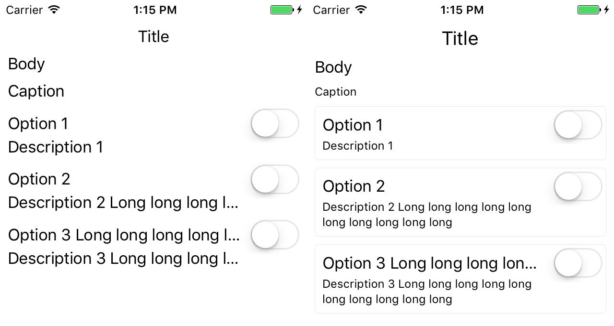

[](https://swift.org/)

[](https://github.com/Carthage/Carthage)
[](https://cocoapods.org/)

# StyleSheet

An approach to define reusable and composable UI styles.

Having some base styles defined you can use them like so:

```swift
final class TitleLabel: UILabel, TitleFontStyle {}
final class BodyLabel: UILabel, BodyFontStyle, MultilineLabelStyle {}
final class CaptionLabel: UILabel, CaptionFontStyle, MultilineLabelStyle {}
```



For a complete usage example see the [Example](Example/) project.

For the implementation details see [`Style.swift`](Sources/Style.swift) and [`RootStyle.swift`](Sources/RootStyle.swift).

## Motivation

### Why to define the UI style in code?

Defining the UI style in code is good because it gives

- _reproducible_,
- _reusable_,
- and _composable_ results.

### Why not to use UIAppearance?

Because we can do better. By avoiding the use of the appearance-proxy we can access _all_ properties and methods (not only `UI_APPEARANCE_SELECTOR` and `dynamic`), and nested objects!

## Supported base classes

| Base class               | UIAppearance | StyleSheet | Notes               |
|--------------------------|--------------|------------|---------------------|
| NSView                   |              | ✓          |                     |
| UIView                   | ✓            | ✓          |                     |
| UIBarItem                | ✓            | ✗          | See the issue [#1](https://github.com/werediver/StyleSheet/issues/1) |

## Installation

### Carthage

```
github "werediver/StyleSheet" ~> 3.1
```

### CacoaPods

```ruby
pod 'StyleSheet', :git => 'https://github.com/werediver/StyleSheet.git', :tag => 'v3.1.0'
```

Note: check the latest available version!

## License

[MIT](https://github.com/werediver/StyleSheet/blob/master/LICENSE)
